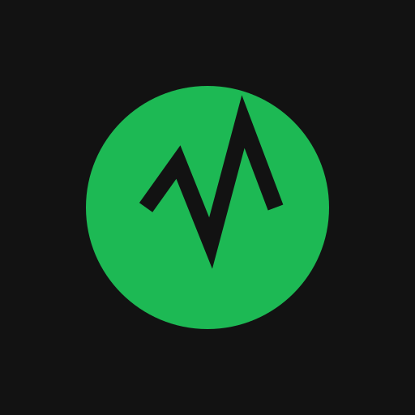

# 🎵 SoundStats

> A futuristic, glassmorphism-styled Last.fm analytics dashboard. Built for **Vercel**.



## ✨ Features

-   **Antigravity Design**: High-fidelity dark mode UI with neon gradients and glassmorphism.
-   **Live Analytics**:
    -   **Deep Dive**: Top artists and tracks with play counts.
    -   **Neon History**: Visualized listening history.
    -   **Listening Clock**: Circular visualization of your daily listening habits.
-   **Pure Last.fm**: Connects directly to Last.fm public API. No Spotify login required.
-   **Vercel Ready**: Serverless backend structure (`api/index.py`) for secure API key handling.

## 🚀 Getting Started

### Prerequisites

-   Use a modern browser.
-   Get a [Last.fm API Key](https://www.last.fm/api/account/create).

### 🛠️ Local Development

1.  **Clone the repo**
    ```bash
    git clone https://github.com/yourusername/soundstats.git
    cd soundstats
    ```

2.  **Setup Environment**
    ```bash
    cp .env.example .env
    # Edit .env and add your LASTFM_API_KEY
    ```

3.  **Run with Vercel CLI (Recommended)**
    ```bash
    npm i -g vercel
    vercel dev
    ```
    *This mimics the production environment and handles the Python API functions.*

4.  **Open the App**
    Visit `http://localhost:3000`

## ☁️ Deployment (Vercel)

1.  Push to GitHub.
2.  Import project in Vercel.
3.  Add Environment Variable: `LASTFM_API_KEY`.
4.  Deploy!

## 🏗️ Tech Stack

-   **Frontend**: Vanilla JS, Chart.js, CSS3 (Glassmorphism).
-   **Backend**: Python (FastAPI on Vercel Serverless).

## 🎨 Design Philosophy

The "Antigravity" aesthetic focuses on:
-   **Depth**: Shadows and blurs for floating layers.
-   **Vibrancy**: Neon accents (`#1DB954`, `#00F0FF`) on deep dark backgrounds.
-   **Motion**: Smooth transitions.

## 📄 License

MIT License.
